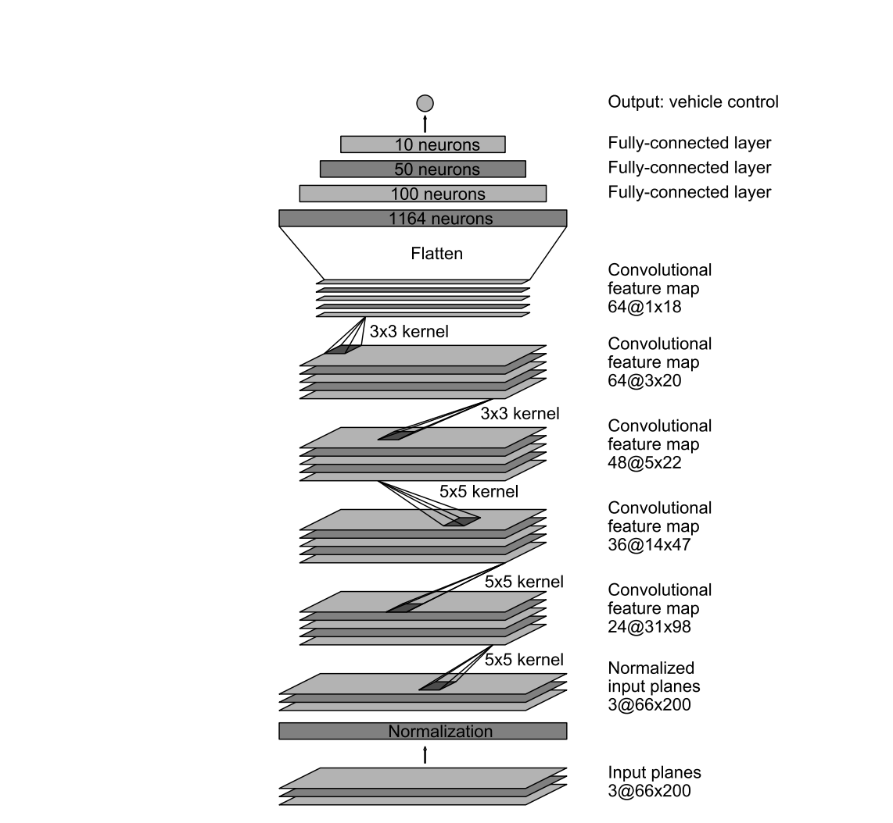
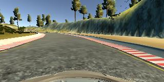
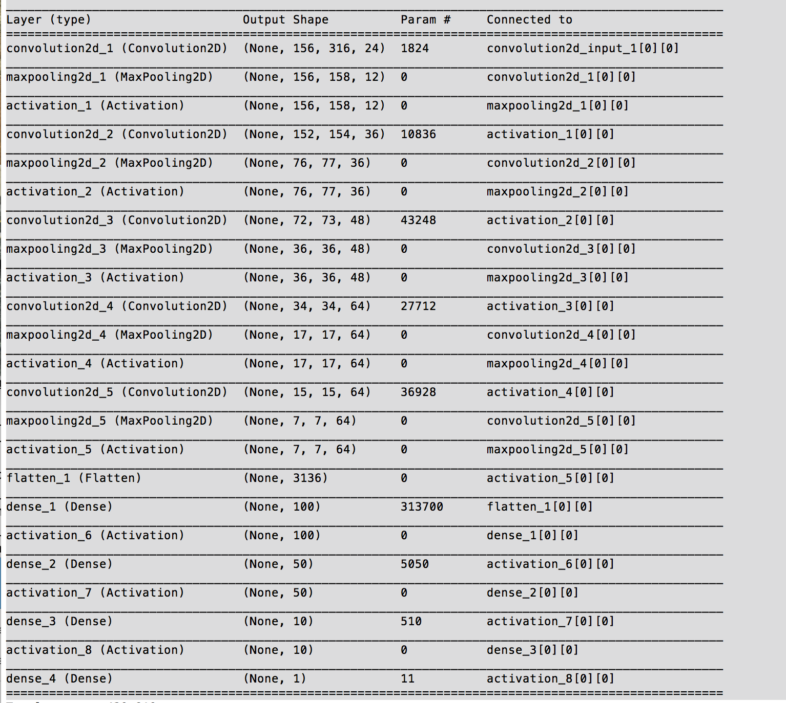

# BehaviorCloning

Model Architecture Design,
Architecture Characteristics,
Data Preprocessing and
Model Training (Include hyperparameter tuni

# Udacity self driving course-BehaviorCloning Project

This project is to use deep neural network to do autonmous driving in the simulated enviroment. The simulator run in two modes:  training mode and autonomous mode. 

During the training mode, we collect the data such as brake, throttle, speed, steering angle as well as images from the vehicle.  In autonomous mode, live image is fed into the trained model which then generates steering angle.

By manually driving the vehicle in Training Mode and using the images from the vehicle as features, with the associated steering angles as labels, I was able to develop a Deep Neural Network to control the steering of the vehicle as it drove around the track.

## Model Architecture Design and Characteristics

The network architecture that I used was inspired by a paper titled [End to End Learning for Self-Driving Cars](http://images.nvidia.com/content/tegra/automotive/images/2016/solutions/pdf/end-to-end-dl-using-px.pdf). In that paper, they present the following figure which depicts the architecture that they used to map images to steering commands:

This model consists of data normalization, followed by 3 5x5 convolutional layers, followed by 2 3x3 convolutional layers, followed by 3 fully connected layers, followed by the output layer. 

The only modification that I made to this architecture was the addition of a 2-Dimensional max-pooling layer after each convolutional layer to further reduce the number of model parameters and help reduce overfitting.

I experimented with various model structures but eventually the above network architecture by NVIDIA seems to work pretty well.

## Data Processing

Training dataset was generated first by driving the vehicle in simulated mode around the track for several loops.  However, based on this data alone, the model did not learn how to recover the vehicle if it ever veered off course. To teach the model how to recover the vehicle,  two laps of recovering the vehicle from wandering to the right, followed by two laps of recovering the vehicle from wandering to the left. 

Eventually, my training data consists of two laps weaving out the right and recovering, and another two laps weaving out to the left and recovering and 4 laps of centerline driving.

After training the model using this data, I found that the model was able to drive the vehicle through almost all of the loop. The only place that the model had an issue was the sole right turn on the course. To remedy this, I collected more data of manual driving on that turn as well as recovering from a veering to the left on that turn. Additionally, I included multiple copies of these data points in the training data.

An example of the training image is as follows:

The dataset was normalized and then randomly shuffled to prevent overfitting.  I split into 90/10 for training and validation dataset. 

### Model Training

I tried 5 epochs.  The training accuracy was about 56% and validation accuracy was 57% each epcho.  Adding more epochs does not seem to improve the accuracy.  

I also tried different batch size and it doesnot seem to have too much difference on the accuracy.  I finally settled to have to 5 epochs and batch size is 32.

I optimized the model using Adam Optimizer with a mean-sqaured-error loss metric.  Adam Optimizer seems to have better performance than GradientDescent.

Here is the model summary:

For Testing process, I modified drive.py to normalize the images as I did in training phase.   I ran the simulator in Autonomous Mode to test if the model was able to generate steering angles which would keep the vehicle on the track as it drove around the loop.
